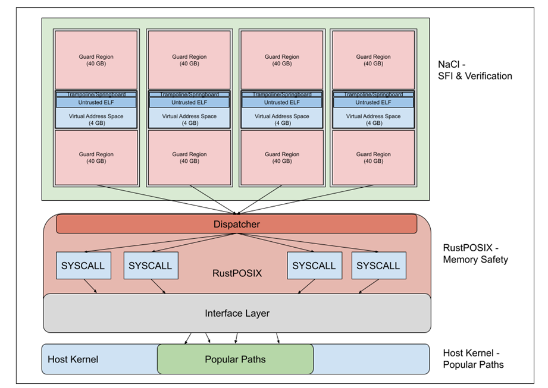

# **Lind: Secure Lightweight Cloud Computing**

Lind is a single-process sandbox that provides an option to safely execute programs. Lind executes applications using software fault isolation and a unikernel to limit the potential of reaching bugs or security flaws in the application.

Lind is an attempt to provide a new secure lightweight cloud computing environment in the form of a new library operating system. The goal of the project is to create a lightweight cloud runtime environment for x86, using [Native Client (NaCl)](https://en.wikipedia.org/wiki/Google_Native_Client) and [Rust](https://www.rust-lang.org/). The project will implement a useful subset of the POSIX API within NaCl to run through Repy. This wiki page details the motivation and design of Lind, and explains how you can start using it yourself.

In Old Norse, Old High German and Old English a “lind” is a shield constructed with two layers of linden wood. Linden wood shields are lightweight, and do not split easily, an appropriate metaphor for a sandboxing system which employs two technologies.

## Contents

* [Lind Architectural Description](./Lind-Architectural-Description.md)
* [Installing and Running Lind](./Installing-and-Running-Lind.md)
* [Building Lind From Scratch](./Building-Lind-From-Scratch.md)
* [Adding SafePOSIX Implementation of Syscalls](./Adding-SafePOSIX-Implementation-of-Syscalls.md)
* [Cross Compiling and Building Lind Binaries](./Cross-Compiling-and-Building-Lind-Binaries.md)
* [Debugging and Profiling Techniques](./Debugging-and-Profiling-Techniques.md)
* [Lind Tools (lind,-lindsh,-lindfs)](./Lind-Tools-(lind,-lindsh,-lindfs).md)
* [Lind with VSCode](./Lind-with-VSCode.md)
* [Lind's Test Suite](./Lind's-Test-Suite.md)
* [Running Applications](./Running-Applications.md)
* [Running the Lind LAMP Stack Demo](./Running-the-Lind-LAMP-Stack-Demo.md)

## **Motivation**

---

The motivation for this system is to expand NaCl’s access to the system to commonly used functionality like sockets and simple file I/O, while still providing the necessary spatial and performance isolation, as well as portability to make running untrusted applications possible. We think when coupled with NaCl’s safe execution, this makes a safe and powerful environment for some class applications which have complex compute requirements, but simple system access needs.

## **Design**

---

### **How is Lind implemented?**
We constructed a prototype architecture for the Lind sandbox to satisfy the isolation and performance requirements. Efficient computation and providing a broad array of system services are the two goals of the Lind sandbox. For computation, Lind leverages ​Google Native Client (NaCl) execution environment. NaCl allows the efficient execution of legacy code in the form of x86 and ARM binaries that are built with a lightly modified compiler tool chain. For operating system access, Lind provides a subset of the POSIX API which is sufficient for many programs. The POSIX API, which itself is difficult to secure, is constructed using Rust which provides performance isolation and memory safety.

Lind is designed to minimize its footprint within the TCB. To do that, most of the Lind code runs within NaCl Rust.

We’ve used Rust to build a library OS. The libOS runs an RPC server which allows it to service calls from the NaCl instance. Within the NaCl instance, we load a modified glibc where each system call of interest is redirected to the libOS. The initial version of Lind will focus on networking and file I/O. So for example, the fopen system call is marshaled and sent via RPC to the Rust-POSIX libOS. The  libOS opens the file on behalf of the NaCl program (with all the restrictions Rust programs have on their file operations).

### **Faking System Calls**

One nice property of the Lind design is that we can pick which system calls we will support with Lind. System calls broadly fall into a few categories. First, system calls which we leave alone. Those are calls like brk. Second, some calls are emulated, for example open. Third, some calls will be faked. Faked calls are those which there will be no direct analog for in Rust. For instance file system permission related calls will be faked because the libOS does not have access to the global file system, only their own local file system.

### **Library OS**

One part of Lind is the library OS built with Rust. Though in the early stages of development, we intend to make a component based system, where components satisfy different subsystems requests. The intent is to allow custom steps including transparent in memory file systems, or over network file systems. Finally, we intend to support process migration, so that will be designed into the OS base.

### **Why Rust**

Calls within SafePOSIX are protected by Rust’s memory safety model. The Rust programming language is designed for safety while maintaining high-performance. It can also guarantee memory safety without garbage collection, which it achieves by using a borrow checker to validate references. This allows it to achieve the performance of languages without garbage collection, such as C/C++. Rust is especially valuable for safe concurrency.
Rust is designed to be memory safe, and it does not permit null pointers, dangling pointers, or data races in safe code. It instead uses an Option type to determine if a value is Some or None. Rust also introduces added syntax to manage lifetimes, and the compiler reasons about these through its borrow checker. According to developers at Google, 70% of software bugs are memory safety issues. We are using Rust for the development of SafePOSIX to control those issues.

Conceptional view of the Lind library OS.

### **How is Lind different from other Sandboxing and Software Fault Isolation techniques?**

Most existing sandboxing techniques like ​Microsoft's Drawbridge, ​Apple's Sandbox and ​Docker project require some kernel modifications which reduces the portability of applications. In comparison, Lind completely exists in the user space without requiring any kernel changes, thereby increasing the portability of the solution.

There are different granularities of isolation. Object based isolation in a programming language might not isolate CPU or file system between each object. A purpose built virtual machine on the other hand offers perfect isolation, but is expensive and inefficient. Lind is a tradeoff of the two extremes. It is designed to run compiled binary applications on many platforms, while monitoring and controlling the resource usage of a process through flexible polices, allowing a per-application policy approach to building systems.

Because Lind relies on ​Google Native Client and RustPOSIX, each having a very small trusted computing base (TCB), the resulting trusted computing base of Lind is very small. Because of a small TCB, we can be more confident of the absence of security bugs in Lind itself.

### **Goals**

*   Minimal additions to the NaCl TCB.
*   Use safe Rust where possible
*   Individually verify unsafe Rust code blocks

### **Trust Domains**

Code can be broken down into trusted and untrusted. The majority of the untrusted Lind code is sandboxed by NaCl or RustPOSIX. In Lind, the TCB (trusted code base) is the native client sel_ldr and the Rust libOS.The whole system runs in 2 or more process:

*   One or more NaCl sel_ldrs
*   The RustPOSIX libOS

## **How programs are built and run**

Lind programs are standard C programs (or anything else gcc compiles to x86); however, they must be compiled with the Native Client GCC implementation, and linked with a special version of glibc built for Lind. The native client gcc is a slightly modified gcc which produces x86 code that can be verified.
The Lind glibc redirects system calls, originally intended for the OS, to lind-glibc. Then, lind-glibc forwards these calls to NaCl, where one of three scenarios occurs: 
  1. The system call is entirely handled within NaCl
  2. The system call is sent to RustPosix and emulated entirely in userspace
  3. The system call is forwarded to RustPosix but then requires kernel interaction.

Besides the above handling of syscalls, building applications for Lind is no different than building standard programs with GCC.