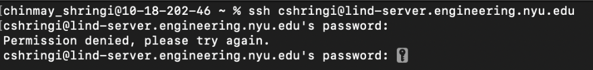
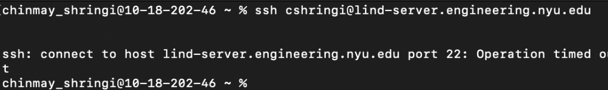
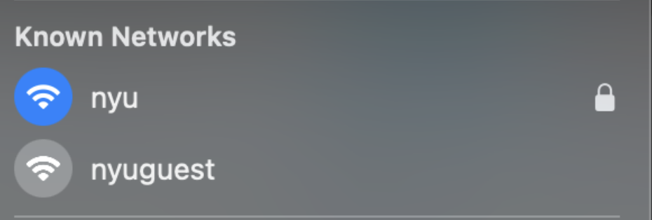
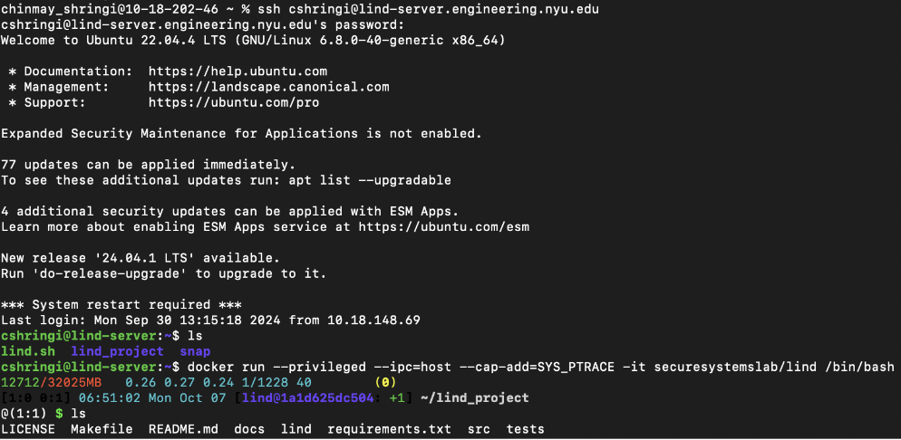

# Installing and Running Lind

## Installation

Pull the image from DockerHub, if you haven't already
`docker pull securesystemslab/lind`

Creating a new container: 
`docker run --privileged --ipc=host --cap-add=SYS_PTRACE -it securesystemslab/lind /bin/bash`

## SSH Setup with Lind

### Overview
This document provides a step-by-step guide to access the NYU SSH server and run Docker commands to set up and test the Lind project. If you face issues while accessing the server, troubleshooting steps are included to help you resolve them efficiently.

### Accessing the SSH Server
#### SSH Command Format
To gain access, use the following SSH command format:

```bash
[username]@lind-server.engineering.nyu.edu
```

**Description**: Replace `[username]` with your NYU username to connect to the Lind server. This command will initiate a secure shell connection to the server, allowing you to work on the remote system.

#### Troubleshooting Access Issues
##### Permission Denied
- **Description**: This usually means that the password is incorrect. Please try to recall the correct password or contact seniors for assistance, or ask for help in the Slack channel.

  

##### Operation Timed Out / Unable to Resolve Host
- **Description**: This error generally means that your network is incorrect or unavailable.

  

#### Network Verification
To verify network connectivity, follow these steps:

1. **Are you on an on-campus network?**

   

2. If connected but still unable to access, contact seniors or use the Slack channel for support.

3. If not connected to the on-campus network, connect to VPN via the [NYU VPN Guide](https://www.nyu.edu/life/information-technology/infrastructure/network-services/vpn.html).

### Running Docker
#### Running the Docker Container


Once you have SSH access, run the Docker container with the following command:

```bash
docker run --privileged --ipc=host --cap-add=SYS_PTRACE -it securesystemslab/lind /bin/bash
```

**Description**: This command starts a Docker container using the image `securesystemslab/lind`. The options used are:

- `--privileged`: Grants extended privileges to the container.
- `--ipc=host`: Allows the container to share the host’s IPC namespace, enabling shared memory.
- `--cap-add=SYS_PTRACE`: Adds the capability to use `ptrace`, which is helpful for debugging.
- `-it`: Opens an interactive terminal session.
- `/bin/bash`: Launches a Bash shell inside the container.

**Note**: This command will give you an interactive shell inside the Docker container where you can run other commands.

### Next Steps After Running Docker
#### Checking Git Branch and Updating
Once inside the container:

1. **Ensure you are on the `develop` branch**. Run the following commands to check and update:

    ```bash
    git branch
    ```

    **Description**: Displays the current branch. Ensure that you are on the `develop` branch.

    ```bash
    git pull
    ```

    **Description**: Fetches the latest updates from the remote repository and merges them into your current branch.

#### Building Lind
1. **Update Contents**:
   - Run the following command to update contents to the newest version:

     ```bash
     make -2
     ```

     **Description**: This command will ensure that all the components are updated to the latest version. The `make` command runs the instructions defined in the Makefile, and the `-2` argument here specifies a particular target or set of actions.

2. **Build the Regular Lind Version**:
   - Run the following command to build the standard version of Lind:

     ```bash
     make -1
     ```

     **Description**: This command builds the standard version of Lind, preparing it for use.

## Compiling and Running a program with Lind
You cannot directly use `gcc` to compile programs for Lind. Instead, you can run the tool `lindsh` first, and use the commands `compile`, `gcc`, or `cc` in this special compiler.

#### 1. Compile a hello world! from source with lindsh
Compile the `hello.c` file under the `/home/lind/lind_project/tests/test_cases/` directory

```bash
$ lindsh
@[/home/lind/lind_project] lind> compile [absolutepath]/path/to/hello.c -o /home/lind/lind_project/hello.nexe 
```
#### 2. Copy the .nexe file to lindfs, source and destination arguments must be absolute paths.

If you’re inside lindsh: 
`cp /home/lind/lind_project/hello.nexe hello.nexe`

From container: 
`lindfs cp ~/the/path/ /home/lind/lind_project/hello.nexe hello.nexe`

The first argument is where your executable file is located in the container. The second argument is where you want to put your executable in the Lind file system. Note you have to give the executable file a name in the Lind file system. 
The `cp` command can also recursively copy directories--if your second argument is a directory, it will copy the directory and any of its contents recursively, their paths are still relative to the first argument.

#### 3. Check if the .nexe file has been copied over
After exiting `lindsh` you can use the `lindfs` tool to check if it exists in the lind filesystem. 
`lindfs find | grep 'hello'`

Alternatively, you can use `lindsh ls /[path]/` to run a ls command and locate the file.

If you see your executable file is under the path you designated before, it means that you have successfully copied the file into the Lind file system.

#### 4. Run the .nexe file
You can run the executable with `lind /[path]/hello.nexe` or `run /hello.nexe` if you are in `lindsh` (alternate aliases for this command are `r`, `exec`, and `execute`).
