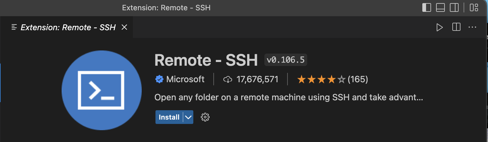
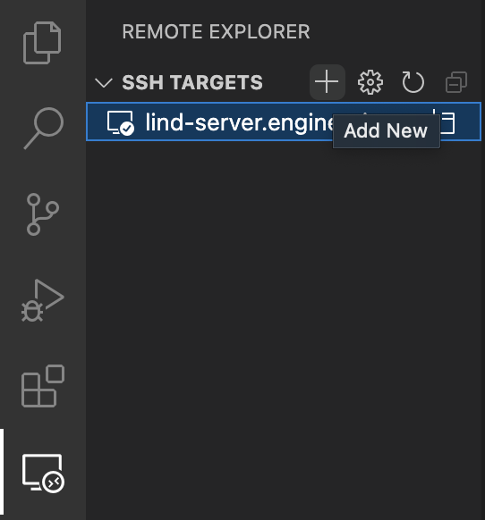
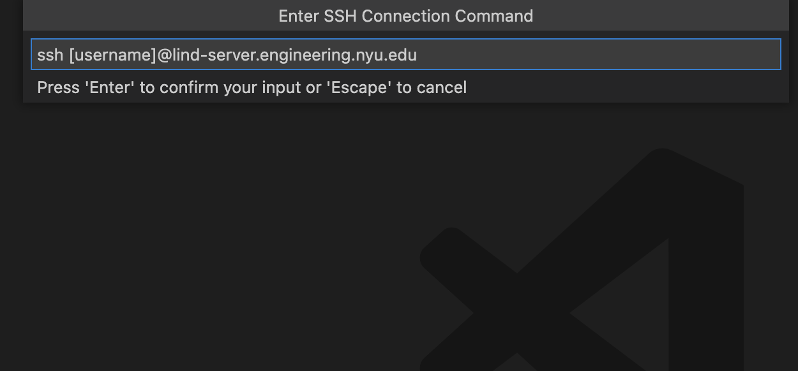
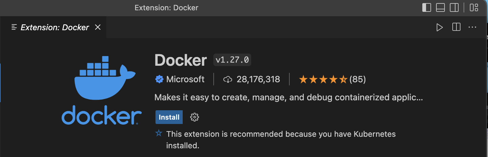
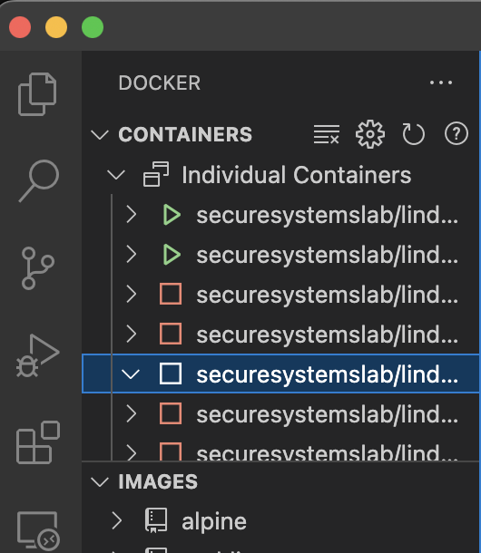

# Step 1: Connect to NYU VPN

If you are on campus and using the NYU network, you can skip Step 1.

1. Install openconnect:

`$ sudo apt-get install openconnect network-manager-openconnect network-manager-openconnect-gnome`

2. Connect:

`$ sudo openconnect vpn.nyu.edu`

Then follow the instructions

# Step 2: Install Remote - SSH on VSCode

1. Open Extensions in VScode and find `Remote - SSH` 

2. After installation, click the `Remote Explorer` button located at left toolbar, then click the plus sign (`Add New`) next to SSH target. 

3. Then type `ssh [username]@lind-server.engineering.nyu.edu -A` and connect to the Lind server.

# Step 3: Install Docker on VScode

1. Open Extensions in VScode and find `Docker`

# Step 4: Modify Lind source code in VScode

1. Click Docker icon on the left side-bar

2. Find your container and start working

