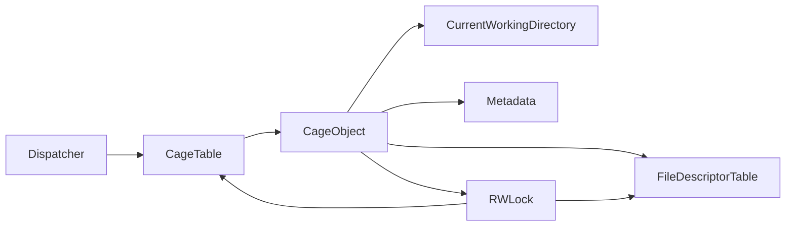

# Cages: The Secure Execution Environments in Lind

In the context of the Lind project, a "cage" refers to an isolated execution environment for running untrusted applications. Cages are the fundamental building blocks that enable Lind to provide a secure and isolated platform for executing potentially malicious or buggy software.

### Key Characteristics of Cages

1. **Isolation**:
   - Cages are designed to provide a secure, isolated environment for running applications.
   - This isolation helps prevent untrusted applications from accessing or modifying sensitive parts of the underlying system, ensuring the overall security and integrity of the system.

2. **Resource Management**:
   - Each cage has its own set of resources, such as a file descriptor table, current working directory, and other metadata.
   - This per-cage resource management allows the Lind system to allocate and control resources in a granular and efficient manner, without cross-contamination between different applications.

3. **POSIX Interface**:
   - The RustPOSIX component is responsible for providing a POSIX-compatible interface for the cages.
   - This allows applications running inside the cages to interact with the underlying operating system in a secure and familiar manner, without directly accessing the system's resources.

### Cage Objects and the Cage Table

1. **Cage Objects**:
   - In the RustPOSIX implementation, the cages are represented by "Cage Objects".
   - These objects encapsulate the state and behavior associated with each isolated execution environment, including the file descriptor table, current working directory, and other metadata.

2. **Cage Table**:
   - RustPOSIX maintains a "Cage Table" that keeps track of all the active cages in the system.
   - When a system call request comes in, the Dispatcher first checks if the corresponding cage exists in the Cage Table before handling the request.
   - This ensures that the system call is directed to the appropriate cage, maintaining the isolation and security guarantees provided by the Lind architecture.

